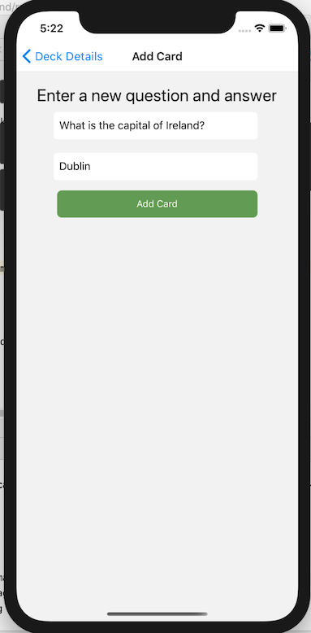
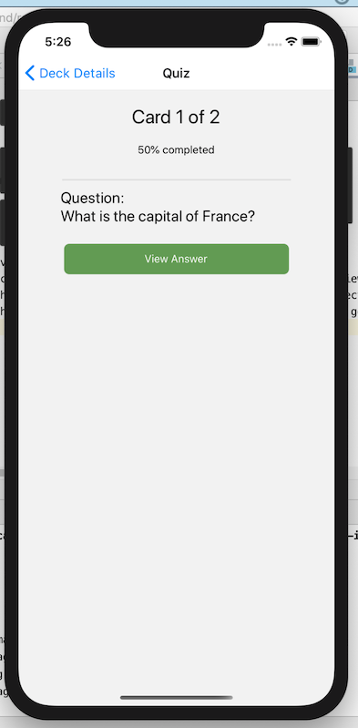
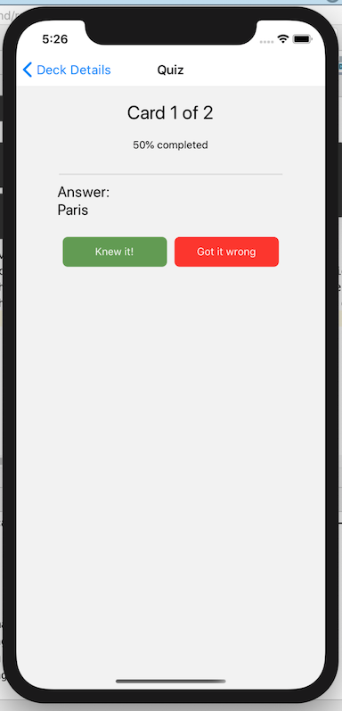

# 'Mobile Flashcards' Project

The 'Mobile Flashcards' application was developed as part of the Udacity React Nanodegree Program.

This is a mobile application than can be used to practize quiz-style questions using fashcards.

## Installing the App
### Node and NPM
This application was developed using Node.js, version v13.11.0.  
Just go to the [official Node.js website](https://nodejs.org/) and download the installer.
Also, be sure to have `git` available in your PATH, `npm` might need it (You can find git [here](https://git-scm.com/)).

### Expo CLI
You will need the Expo CLI in order to run the application in a simulator;
You can install this dependency using `npm install -g expo-cli`
More info on the Expo CLI can be found [here](https://docs.expo.io/versions/latest/workflow/expo-cli/).

### 'Mobile Flashcards' Application
* Clone or download this project: `git clone https://github.com/hdatteln/reactnative-flashcards.git` 
* In the project's root directory, run `npm install` to install the required packages

## Running the App
* In the project's root directory, run `expo start` to start the application.
* A new browser window should automatically open and display the various expo simulator options.

## Using the App
### Deck List View
If no flashcard decks have been created yet, this page shows an according message. 
Otherwise, it shows a list of available decks. When clicking on a deck, the Deck Details view opens.
New decks can be added by clicking the 'Add Deck' bottom tab navigation option.  

.

### Add Deck View
Simply enter a title for the new deck and click the button. You can add cards later.  
  

### Deck Details View
Clicking on a Deck brings you to the deck details view.
From here, you can add new cards to the deck, start a quiz, or remove the deck

  

### Add New Card View
Enter a new question & answer to submit a new card

  

## Quiz
Start the quiz via the Deck Details view.  
You will see the questions of the deck displayed to you, and you can click the button to view the answer.  
On the Answer screen, click one of the buttons to indicate whether you thought of the correct or incorrect answer.
At the end of the quiz, you'll get the overall score, and an option to restart the quiz of go back to the deck list view.

  
  
  

